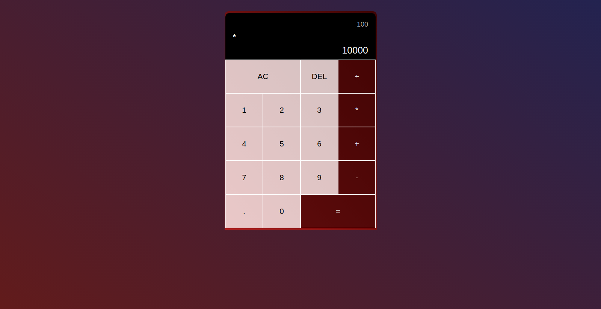
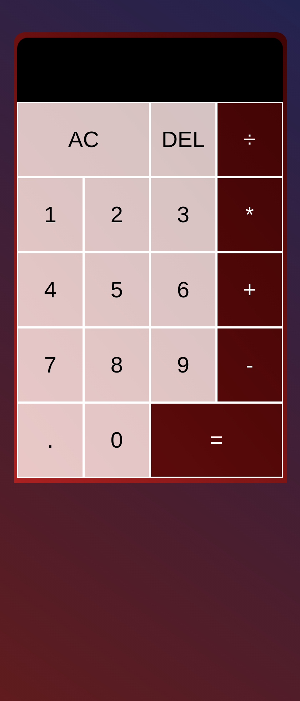

# Calculator

> This is an awesome calculator, you can add, subtract, divide, and multiply numbers.

> |Big screen       |Small Screen|
> |--------------|--------------|
> ||| 

> I used classes to create this calculator. And followed clean code principles

## Built With

- HTML, CSS
- JS & ECMA 6
- Linters (hint, stylelint, eslint)

## Live Demo

[Live Demo Link](https://livedemo.com)

### Prerequisites
  #### Have knowledge in these technologies
    - HTML, CSS
    - JS & ECMA 6
### Setup
  - Open your command
  - Type `git clone link`
  - `code .` (to open your VS code)
  - Enjoy

## Authors

:bearded_person: **Ahmed Omar**
  - Github: [@Ahmed-Alfarouq](https://github.com/ahmed-al-farouq)
  - LinkedIn: [LinkedIn](https://www.linkedin.com/in/ahmed-al-farouq/)
  - Twitter: [@twitter](https://twitter.com/ahmed_al_farouq)

## 🤝 Contributing

Contributions, issues, and feature requests are welcome!

Feel free to check the [issues page](../../issues/).

## Show your support

Give a ⭐️ if you like this project!